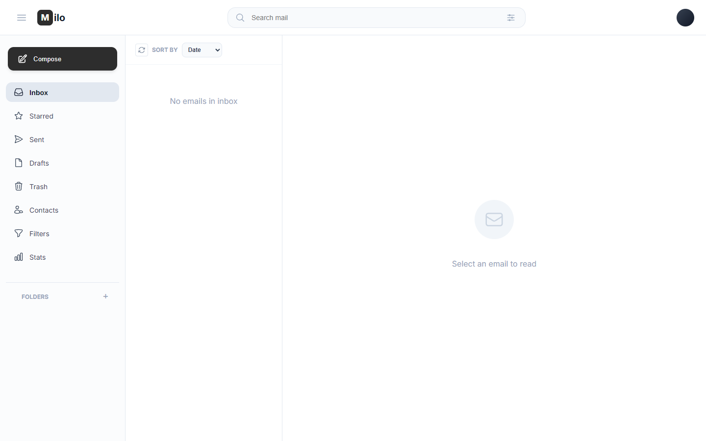
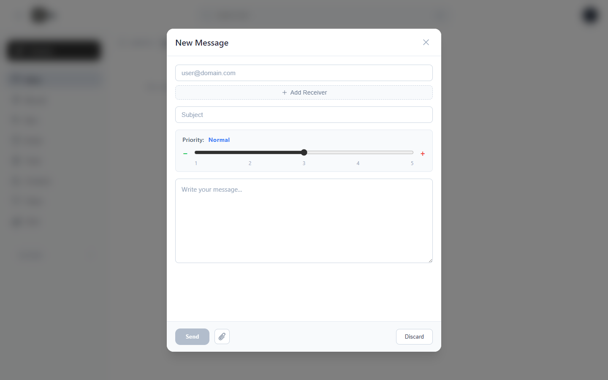
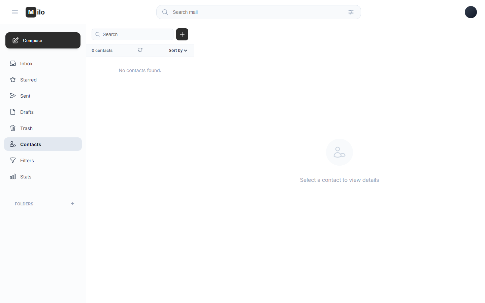
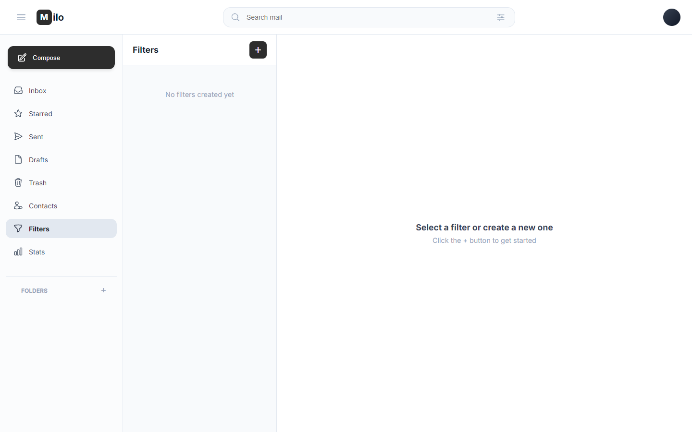

# 📬 Milo Mail



### Screenshots
| Login | Compose | Contacts | Filters |
|---|---|---|---|
|  |  |  |  |

A full-stack web-based email client with composing, folders, contacts, filter rules, attachments, and JWT authentication.

> **University assignment** — Programming 2 (OOP), Fall 2023, Faculty of Engineering – Alexandria University (CSED).

---

## What It Does

Milo Mail lets users register, send/receive emails (with attachments & priority levels), organise messages into system and custom folders, star emails, define automatic filter rules on incoming mail, and manage a contacts list — all through a responsive SPA.

## Tech Stack

| Layer    | Technology                                             |
| -------- | ------------------------------------------------------ |
| Frontend | Angular 20, TypeScript, Tailwind CSS, SweetAlert2      |
| Backend  | Spring Boot 4 (Java 21), Spring Security, Lombok, JWT  |
| Database | PostgreSQL (Flyway migrations)                         |
| Caching  | Caffeine (in-memory, 500-entry / 10 min TTL)           |

## Design Choices

- **Strategy pattern** — runtime-swappable sorting (by date, subject, priority, sender, etc.) for mails and contacts.
- **Criteria / Filter pattern** — composable filters (sender, receiver, subject, body, date parts, priority, has-attachment).
- **Factory** — `CriteriaFactory` & `ActionFactory` instantiate the right filter/action from user input strings.
- **Prototype** — deep-clones `Mail` (including attachments) when sending to multiple receivers or converting a draft.
- **Command** — `FilterRuleAction` hierarchy (`MoveToAction`, `StarAction`, `MarkAsReadAction`) executed by `FilterRule`.
- **Builder** (Lombok `@Builder`) — fluent mail construction.
- **Facade** — `MailController` → `MailService` hides repository/mapper complexity from the client.
- **Singleton** — Spring-managed beans (`@Service`, `@Repository`, `@Component`).
- **Chain of Responsibility** — `JWTFilter` in Spring Security's filter chain.
- **Observer** — Angular Signals + RxJS Observables for reactive state management.
- **Interceptor** — `AuthInterceptor` auto-attaches JWT Bearer tokens to every HTTP request.
- **Mapper** — `MailMapper` / `AttachmentMapper` for DTO ↔ Entity conversion.

## Project Structure

```
Milo-mail-web-application/
├── Milo/                          # Angular frontend
│   └── src/app/
│       ├── components/            # compose, email-list, email-viewer, contacts,
│       │                            filters, header, sidebar, login, sign-up, stats …
│       ├── Services/              # API service layer
│       ├── models/                # TypeScript interfaces
│       ├── guards/                # Route guards
│       └── interceptors/          # Auth interceptor
├── Milo-Backend/                  # Spring Boot backend
│   └── src/main/java/com/app/milobackend/
│       ├── controllers/
│       ├── services/
│       ├── models/
│       ├── dtos/
│       ├── repositories/
│       ├── strategies/            # Sorting strategies
│       ├── filter/                # Criteria & filter-rule logic
│       ├── commands/              # Filter-rule actions (Command pattern)
│       ├── mappers/
│       └── configs/               # Security, CORS, cache config
├── docs/                          # Report (LaTeX), UML diagrams (PlantUML)
└── README.md
```

## Configuration

All backend config lives in a single file — no `.env` is used:

```
Milo-Backend/src/main/resources/application.properties
```

Key properties to review before running:

```properties
spring.datasource.url=jdbc:postgresql://localhost:5432/dilo
spring.datasource.username=postgres
spring.datasource.password=12345678
```

The frontend API base URL is set in:

```
Milo/src/environments/environment.ts          # → http://localhost:8080
Milo/src/environments/environment.development.ts
```

## How to Run

### Prerequisites

- JDK 21 + Maven
- Node.js ≥ 18 + npm
- Angular CLI (`npm i -g @angular/cli`)
- PostgreSQL running on port **5432**

### 1 — Database

```bash
# create the database (psql)
CREATE DATABASE dilo;
```

Update credentials in `application.properties` if yours differ from the defaults above.

### 2 — Backend

```bash
cd Milo-Backend
mvn spring-boot:run        # starts on http://localhost:8080
```

### 3 — Frontend

```bash
cd Milo
npm install
ng serve                   # starts on http://localhost:4200
```


## Observations & Known Limitations

- **Trash retention** is hard-coded to 1 minute in `application.properties` (for demo purposes); change `app.trash.retention-minutes` to something like `43200` (30 days) for production.
- **No email-over-SMTP** — the app simulates email delivery within its own database; `spring-boot-starter-mail` is a dependency but isn't wired to an external SMTP server.
- **Self-sent mail duplication** — sending to yourself creates two copies (Inbox + Sent); starring one auto-stars both, and the Starred folder deduplicates.
- **Single action per filter rule** — only one action is applied per rule (priority: Move > Star > Mark as Read).
- Passwords in `application.properties` are committed in plain text — acceptable for a course project, not for production.
- File upload limit is set to **1 GB** per file / **2 GB** per request.

## Contributors

- [@tofyfathy12](https://github.com/tofyfathy12)
- [@AnasAli77](https://github.com/AnasAli77)
- [@BigadElsayed](https://github.com/BigadElsayed)
- [@Joo-Ashraf1](https://github.com/Joo-Ashraf1)